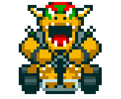

🏁 Simulador de Corridas do Mario Kart com Node.js | DIO

Neste projeto foi desenvolvido um simulador de corrida inspirado no Mario Kart, onde as habilidades dos personagens e as variáveis das pistas são consideradas para determinar o vencedor. O desenvolvimento foi realizado em Node.js, garantindo leveza e escalabilidade.

<table> <tr> <td>  </td> <td> <b>Objetivo:</b> 
Mario Kart é uma famosa série de jogos de corrida desenvolvida e publicada pela Nintendo. O desafio aqui é criar a lógica de um jogo para simular corridas de Mario Kart, aplicando regras e mecânicas semelhantes às originais.
 </td> </tr> </table>
🎮 Personagens Disponíveis
<table style="border-collapse: collapse; width: 800px; margin: 0 auto;"> <tr> <td style="border: 1px solid black; text-align: center;"> 
<b>Mario</b>
  </td> <td style="border: 1px solid black; text-align: center;"> 
Velocidade: 4
 
Manobrabilidade: 3
 
Poder: 3
 </td> <td style="border: 1px solid black; text-align: center;"> 
<b>Peach</b>
  </td> <td style="border: 1px solid black; text-align: center;"> 
Velocidade: 3
 
Manobrabilidade: 4
 
Poder: 2
 </td> <td style="border: 1px solid black; text-align: center;"> 
<b>Yoshi</b>
  </td> <td style="border: 1px solid black; text-align: center;"> 
Velocidade: 2
 
Manobrabilidade: 4
 
Poder: 3
 </td> </tr> <tr> <td style="border: 1px solid black; text-align: center;"> 
<b>Bowser</b>
  </td> <td style="border: 1px solid black; text-align: center;"> 
Velocidade: 5
 
Manobrabilidade: 2
 
Poder: 5
 </td> <td style="border: 1px solid black; text-align: center;"> 
<b>Luigi</b>
  </td> <td style="border: 1px solid black; text-align: center;"> 
Velocidade: 3
 
Manobrabilidade: 4
 
Poder: 4
 </td> <td style="border: 1px solid black; text-align: center;"> 
<b>Donkey Kong</b>
  </td> <td style="border: 1px solid black; text-align: center;"> 
Velocidade: 2
 
Manobrabilidade: 2
 
Poder: 5
 </td> </tr> </table>
🕹️ Regras e Mecânicas

Jogadores:

O programa recebe dois personagens como objetos para disputar a corrida.

Pistas:

As corridas ocorrem em uma pista aleatória com 5 rodadas.

A cada rodada, sorteia-se um bloco de pista: reta, curva ou confronto.

Reta: rola-se um dado de 6 lados e soma-se o atributo Velocidade. O maior resultado ganha 1 ponto.

Curva: rola-se um dado de 6 lados e soma-se o atributo Manobrabilidade. O maior resultado ganha 1 ponto.

Confronto: rola-se um dado de 6 lados e soma-se o atributo Poder. O perdedor perde 1 ponto.

A pontuação mínima é 0 (não há valores negativos).

Condição de Vitória:

Ao final das 5 rodadas, vence o jogador com mais pontos.

⚙️ Tecnologias Utilizadas

JavaScript

Node.js

🚀 Como Executar o Projeto

Clone o repositório:

git clone https://github.com/Vinynovac/Simulador-de-Corridas-do-Mario-Kart-com-Node.js

Acesse o diretório do projeto:

cd Simulador-de-Corridas-do-Mario-Kart-com-Node.js

Execute o simulador:

node src/index.js